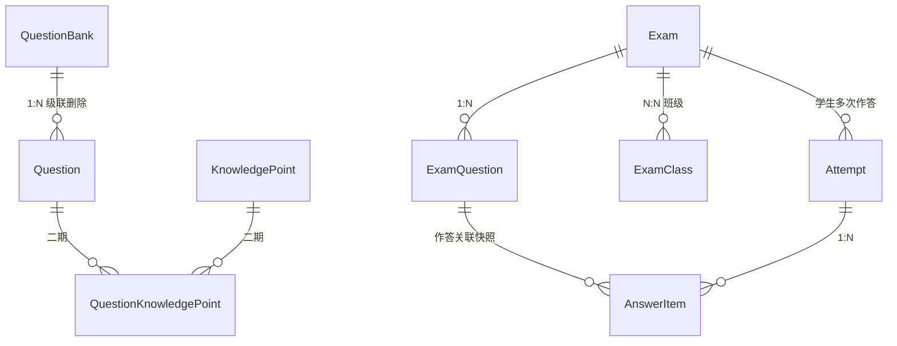

# 题库与题目管理架构设计

> **数据模型以《数据模型总表》为准**；本文档聚焦题库/试卷/作答的架构与解耦设计。

> 本文档为《普职融通智慧题库与智能练测系统》PRD 的组成部分,描述题库、题目、考试/练习、作答/成绩四者的数据架构与关键设计决策。
> 适用技术栈:Next.js(全栈)+ Prisma + MySQL。

---

## 1. 设计目标与核心挑战

本子系统需支撑以下能力:题库的增删改查、从题库组卷生成考试/练习、学生多次作答、以及面向教师的成绩与题目统计;同时为二期功能(按知识点/单元筛选组卷、批量选题、在线编辑题目)预留扩展空间。

核心挑战在于:**“题目如何归类管理”与“题目如何进入考试”是两件生命周期完全不同的事**。若用同一套层级同时承载二者,一旦后期编辑或删除题目,将连带影响已发布的历史试卷与已记录的学生成绩。本架构通过“两套独立层级 + 组卷快照”的方式将二者彻底解耦。

---

## 2. 核心设计原则

1. **管理层与试卷层解耦,以快照连接。** 组卷时把题目内容复制为试卷快照,而非引用原题;此后对原题的任何修改/删除都不影响历史试卷与成绩。
2. **分类维度采用属性/标签,而非层级树。** 题型、难度、教材单元、知识点都是题目的属性,不进入“题库→题目”的硬层级,从而支持正交、多值、可独立筛选。
3. **作答与统计永远基于快照。** 所有成绩、准确率、选项选择率均关联试卷快照(ExamQuestion),而非原题,确保历史数据长期稳定可复算。

---

## 3. 三层数据模型

整体由三层构成,层间关系如下。

### 3.1 管理 / 编辑层

负责题目的组织与维护,是教师日常录入和整理题目的工作区。

- **题库(QuestionBank)1 —— N 题目(Question)**:每道题目仅归属于一个题库,归属关系唯一。
- 题库可选归属于“科目/课程”:一期以 `subject` 字段占位,二期可升级为独立的课程表。
- **题目的分类维度以属性形式存在**:题型(type)、难度(difficulty)、教材单元(unit)为题目字段;知识点为多对多标签(二期启用,一期预留表结构)。

> **设计要点:不要把单元、知识点做成嵌套层级**(如 题库 → 单元 → 知识点 → 题目)。原因有三:一道题可同时命中多个知识点(本质多对多,不是树上的一个位置);单元与知识点是两个正交维度,需各自独立筛选;做成硬层级后重组题库会非常痛苦。属性化之后,二期“按知识点/单元筛选组卷”仅是查询条件的增加,无需改动表结构。

### 3.2 试卷 / 考试层

负责把题目固化为一份可被作答的卷子。

- **考试/练习(Exam)1 —— N 试卷题目(ExamQuestion)**。
- **ExamQuestion 是题目的快照**:组卷时从 Question 复制题干、选项、答案、解析、题型等内容,并附加卷面属性(题序 order、分值 score)。
- **考试/练习 N —— N 班级(Class)**:通过中间表 ExamClass 指定参与的班级。

### 3.3 作答 / 成绩层

负责记录学生的每一次作答及其结果。

- **作答记录(Attempt)**:一名学生对一场考试可有多条记录(支撑“可重复练习 + 重做次数”),以 `attemptNo` 区分。
- **作答记录 1 —— N 答题明细(AnswerItem)**:每条明细对应一道试卷题目的作答。
- **AnswerItem 关联 ExamQuestion(快照),而非原题**,保证统计长期稳定。

### 3.4 实体关系总览



> `Question → ExamQuestion` 不是数据库外键关系,而是**组卷时的一次性内容复制(快照)**;这是整套设计解耦的关键所在,详见第 6 节。

---

## 4. 关键设计决策

| 决策点 | 方案 | 理由 |
|---|---|---|
| 题库与题目关系 | 1 对多,单一归属 | 级联删除语义清晰;契合教师“按章节建题库”的心智模型 |
| 分类维度建模 | 属性 / 标签,非层级树 | 知识点本质多对多;单元与知识点正交;二期筛选仅需查询条件 |
| 组卷方式 | 复制快照(ExamQuestion) | 保护历史试卷与成绩;支持改题/删题;分值随卷而定 |
| 作答关联对象 | 关联快照,非原题 | 准确率、选项选择率等统计长期稳定、可复算 |
| 选项存储 | JSON 数组,每项带稳定 key | 同时支撑选项乱序展示与选项选择率统计 |
| 删除已有成绩的考试 | 软删除 / 归档 | 防止误删整班成绩 |

---

## 5. 数据表设计

> 以下为 Prisma 模型骨架,仅列关键字段;标注「二期」者为预留,一期可暂不实现,但建议先建表以避免后续迁移。

### 5.0 枚举

```prisma
enum QuestionType {
  SINGLE_CHOICE   // 单选
  MULTIPLE_CHOICE // 多选
  TRUE_FALSE      // 判断
  FILL_BLANK      // 填空（一期实现，自动判分见总表 §6）
}

enum ExamType {
  EXAM      // 考试
  PRACTICE  // 练习
}

enum AttemptStatus {
  IN_PROGRESS // 进行中
  SUBMITTED   // 已提交
}
```

### 5.1 题库 QuestionBank

```prisma
model QuestionBank {
  id          Int        @id @default(autoincrement())
  name        String                       // 题库名称
  description String?    @db.Text          // 备注
  subject     String?                      // 科目/课程(二期升级为独立表)
  createdBy   Int                          // 创建教师 id
  teacher     Teacher    @relation(fields: [createdBy], references: [id])
  createdAt   DateTime   @default(now())
  updatedAt   DateTime   @updatedAt
  questions   Question[]
}
```

### 5.2 题目 Question

```prisma
model Question {
  id            Int          @id @default(autoincrement())
  bankId        Int
  bank          QuestionBank @relation(fields: [bankId], references: [id], onDelete: Cascade)

  type          QuestionType
  stem          String       @db.Text       // 题干；填空用占位符标空（如 ____ 或 {{1}}）
  options       Json?                        // [{key:"A",text:"..."}]；判断/填空为 null
  answer        Json                         // 见 §6 答案编码（一律数组化）
  difficulty    Difficulty   @default(MEDIUM)
  analysis      String?      @db.Text

  // 归属维度（一期平铺冗余 String，二期 knowledgePoint 升多对多）
  textbook      String?
  unit          String?
  knowledgePoint String?

  // 导入 / 运维字段
  tags          String?                      // 预留：逗号分隔，后续升多对多
  score         Int?                         // 预留：刷题不用，权威分值在 ExamQuestion
  externalId    String?                      // 原始资料编号，支持"重导更新"
  contentHash   String                       // 去重：题型+归一化题干+答案 的 SHA1
  importBatchId String?                      // 导入批次，支持整批回滚

  createdAt     DateTime     @default(now())
  updatedAt     DateTime     @updatedAt

  // 二期:知识点多对多
  knowledgePoints QuestionKnowledgePoint[]

  @@unique([bankId, contentHash])            // 库内去重；允许同题进多个题库
  @@index([type])
  @@index([difficulty])
  @@index([importBatchId])
}
```

### 5.3 知识点(二期)KnowledgePoint / QuestionKnowledgePoint

```prisma
// ===== 以下为二期预留,建议一期先建表 =====
model KnowledgePoint {
  id        Int                      @id @default(autoincrement())
  name      String
  questions QuestionKnowledgePoint[]
}

model QuestionKnowledgePoint {
  questionId       Int
  knowledgePointId Int
  question         Question       @relation(fields: [questionId], references: [id], onDelete: Cascade)
  knowledgePoint   KnowledgePoint @relation(fields: [knowledgePointId], references: [id], onDelete: Cascade)
  @@id([questionId, knowledgePointId])
}
```

### 5.4 考试 / 练习 Exam

```prisma
model Exam {
  id               Int            @id @default(autoincrement())
  name             String                          // 名称
  type             ExamType                        // 考试 / 练习
  allowRepeat      Boolean        @default(false)  // 是否可重复练习
  repeatLimit      Int?                            // 可重做次数(allowRepeat 时有效,null 为不限)
  deadline         DateTime?                       // 截止时间(可空)
  timeLimitSec     Int?                            // 单次作答时长上限（秒），null=不限时
  shuffleQuestions Boolean        @default(false)  // 题目乱序
  shuffleOptions   Boolean        @default(false)  // 选项乱序
  createdBy        Int
  teacher          Teacher        @relation(fields: [createdBy], references: [id])
  createdAt        DateTime       @default(now())
  deletedAt        DateTime?                       // 软删除标记
  examQuestions    ExamQuestion[]
  classes          ExamClass[]
  attempts         Attempt[]
}
```

### 5.5 试卷题目(快照)ExamQuestion

```prisma
model ExamQuestion {
  id          Int          @id @default(autoincrement())
  examId      Int
  exam        Exam         @relation(fields: [examId], references: [id], onDelete: Cascade)
  sourceId    Int?                          // 溯源原题 id(弱引用,原题删除后仅作记录,不影响卷面)
  order       Int                           // 题序
  score       Float                         // 分值(卷面级)
  // ↓↓↓ 组卷时从 Question 复制的快照字段 ↓↓↓
  type        QuestionType
  stem        String       @db.Text
  options     Json?
  answer      Json
  analysis    String?      @db.Text
  answerItems AnswerItem[]
}
```

> `sourceId` 可实现为两种方式:① 不建外键约束的弱引用 id(原题删除后该值悬空,仅作溯源);② 建为 `onDelete: SetNull` 的可空外键(原题删除后自动置 null)。两者均不影响试卷内容,按团队偏好选择即可。

### 5.6 考试-班级关联 ExamClass

```prisma
model ExamClass {
  examId  Int
  classId Int
  exam    Exam  @relation(fields: [examId], references: [id], onDelete: Cascade)
  class   Class @relation(fields: [classId], references: [id], onDelete: Cascade)
  @@id([examId, classId])
}
```

### 5.7 作答记录 Attempt

```prisma
model Attempt {
  id          Int           @id @default(autoincrement())
  examId      Int
  exam        Exam          @relation(fields: [examId], references: [id], onDelete: Cascade)
  studentId   Int
  student     Student       @relation(fields: [studentId], references: [id], onDelete: Restrict) // 有作答禁止硬删学生
  attemptNo   Int                           // 第几次作答,从 1 开始
  status      AttemptStatus @default(IN_PROGRESS)
  score       Float?                        // 总得分
  elapsedSec  Int           @default(0)     // 已用时间（断点续答 / 考试计时）
  startedAt   DateTime      @default(now())
  lastSavedAt DateTime?                     // 最后一次草稿保存时间
  submittedAt DateTime?
  answerItems AnswerItem[]
  @@unique([examId, studentId, attemptNo])
}
```

### 5.8 答题明细 AnswerItem

```prisma
model AnswerItem {
  id             Int          @id @default(autoincrement())
  attemptId      Int
  attempt        Attempt      @relation(fields: [attemptId], references: [id], onDelete: Cascade)
  examQuestionId Int
  examQuestion   ExamQuestion @relation(fields: [examQuestionId], references: [id], onDelete: Cascade)
  chosen         Json                       // 学生作答,如 ["A"] / ["B","C"]
  isCorrect      Boolean      @default(false)
  scoreGot       Float        @default(0)   // 本题得分
  @@index([examQuestionId])
}
```

### 5.10 错题本 WrongQuestion

> 错题本身可由 `AnswerItem.isCorrect=false` 推导，但"重做次数"需独立持久化，不适合每次从明细重算。一期按考试/练习分开记录，指向 ExamQuestion 快照以保证错题内容长期稳定。

```prisma
model WrongQuestion {
  id             Int      @id @default(autoincrement())
  studentId      Int
  student        Student  @relation(fields: [studentId], references: [id], onDelete: Cascade)
  examQuestionId Int                          // 指向快照，保证错题内容长期稳定
  redoCount      Int      @default(0)         // 重做次数
  lastResult     Boolean?                     // 最近一次重做是否正确
  createdAt      DateTime @default(now())
  updatedAt      DateTime @updatedAt
  @@unique([studentId, examQuestionId])
}
```

---

### 5.9 JSON 字段约定

为保证判分与统计可靠,`options` / `answer` / `chosen` 统一约定如下:

- `options`:`[{ "key": "A", "text": "..." }, ...]`。`key` 在题目生命周期内保持稳定,选项乱序只改变展示顺序、不改变 key。
- `answer`:统一以数组表达——单选 `["A"]`,多选 `["A","C"]`,判断 `["T"]` / `["F"]`；**填空**为每空一个可接受答案数组，如 `[["北京","京城"],["上海"]]`（外层数组对应各空，内层数组为该空的所有可接受答案）。
- `chosen`:与 `answer` 同结构，便于直接比对判分，并按 key 聚合做选项选择率统计；**填空**的 `chosen` 为学生各空的作答字符串，如 `["北京","上海"]`。

**填空自动判分（一期口径）**：对每个空，把学生作答归一化（trim、全半角、可选忽略大小写）后，命中该空可接受答案集合任一即该空正确；**整题判对错口径**：一期采用**全对才算对**（所有空命中 → `isCorrect=true`，得满分；否则 `isCorrect=false`，得 0 分）。如需"按空给分"再在二期放开 `scoreGot` 部分计分。

---

## 6. 组卷流程(快照生成)

一期为“整库导入”,流程如下:

1. 教师选择一个题库。
2. 系统读取该题库的全部题目。
3. 为每道题目创建一条 `ExamQuestion`,复制 `stem` / `options` / `answer` / `analysis` / `type`,并写入 `order`、`score`。
4. 组卷完成,试卷与原题自此互不影响。

由此带来的保障:

- **组卷后浏览整卷、删除某题** = 操作 `ExamQuestion` 记录,不影响题库中的原题。
- **编辑/删除题库原题**(含二期在线编辑)= 不影响任何已生成的试卷与成绩。

> 二期可在“读取题目”一步之前插入筛选(按知识点/单元/题型/难度)与批量勾选,组卷后续逻辑与数据结构均保持不变。

---

## 7. 级联删除与数据完整性策略

| 删除对象 | onDelete 行为 | 说明 |
|---|---|---|
| 题库 QuestionBank | 级联删除其下 Question | 试卷有快照,完全不受影响 |
| 题目 Question | ExamQuestion.sourceId 置 null 或保留为弱引用 | 仅丢失溯源,卷面内容完好 |
| 考试 Exam(无作答) | 级联删除 ExamQuestion / ExamClass | 安全 |
| 考试 Exam(已有作答) | 软删除(写入 deletedAt),不物理删除 | 保护历史成绩 |
| 作答 Attempt | 级联删除其 AnswerItem | |
| 班级 Class | 仅删除 ExamClass 关联,不删考试 | 通过中间表隔离影响 |

---

## 8. 统计口径(对应教师端成绩查看功能)

| 指标 | 数据来源 | 计算方式 |
|---|---|---|
| 平均分 | Attempt.score | 参与作答学生的 score 平均 |
| 分数段分布 | Attempt.score | 按区间(如 80~89)分段计数 |
| 每生练习情况(得分/错题) | Attempt + AnswerItem | 取该生的 Attempt;错题 = `isCorrect = false` 的 AnswerItem |
| 每题准确率 | AnswerItem | 按 examQuestionId 分组,正确数 / 总作答数 |
| 选项选择率 | AnswerItem.chosen | 按 examQuestionId + 选项 key 分组计数 |

因以上指标均关联 `ExamQuestion` 快照,即便原题被修改或删除,统计结果始终可稳定复算。

> **可重复练习口径**：一期统一取**最近一次**已提交作答（`attemptNo` 最大且 `status=SUBMITTED`），不做配置项。

---

## 9. 二期扩展预留

- **知识点多对多**:`KnowledgePoint` / `QuestionKnowledgePoint` 已预留,启用即可。
- **按知识点 / 单元 / 题型 / 难度筛选组卷**:仅在组卷查询中追加 `where` 条件,无需改表。
- **批量选题**:前端增加勾选交互,组卷接口接收题目 id 列表即可,数据结构不变。
- **在线编辑题目**:因快照机制,编辑安全,不影响历史试卷与成绩。
- **题目跨题库复用**(如确有需要):将 `Question.bankId` 的 1 对多迁移为“题库—题目”多对多中间表;因试卷层已快照,该迁移不影响试卷层与作答层,影响面被隔离在管理层内部。
